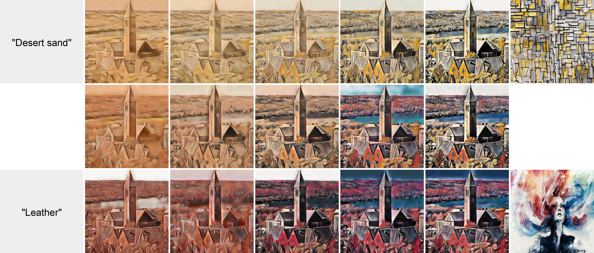

# MMIST
Text Based Image Style Transfer using Cross-modal GAN Inversion.

Base paper - [[Paper](https://arxiv.org/abs/2312.01671)] [[Project Page](https://hywang66.github.io/mmist/)] 

The report for changes made by us in the proeject is
[[Contextual_Loss_Updates](./docs/BTP_report_final.pdf)]



## Installation
Fisrt, clone the repository recursively:
```bash
git clone --recursive https://github.com/hywang66/mmist.git
```

Then, create an conda environment (optional) and install the dependencies:
```bash
pip install -r requirements.txt
```

Next, since we use StyleGAN3, you need to install additional tools including **CUDA toolkit 11.1 or later** and **GCC 7 or later**. See more details in the Requirements section of [StyleGAN3](https://github.com/hywang66/stylegan3)(folked). Note that the python dependencies are already installed in the previous step.

Next, download the wikiart pre-trained StyleGAN3 model from [here](https://drive.google.com/file/d/18MOpwTMJsl_Z17q-wQVnaRLCUFZYSNkj) and put it under `./stylegan3/models/`. Its path should be `./models/wikiart-1024-stylegan3-t-17.2Mimg.pkl`

Next, download the pretrained AdaAttN model from [here](https://drive.google.com/file/d/1XvpD1eI4JeCBIaW5uwMT6ojF_qlzM_lo/view?usp=sharing) and copy it to the `checkpoints` folder in the AdaAttN repo, and unzip it. See more detailes in the forked [AdaAttN repo](https://github.com/hywang66/AdaAttN). Specifically:
```bash
cd AdaAttN
mkdir checkpoints
mv [Download Directory]/AdaAttN_model.zip checkpoints/
unzip checkpoints/AdaAttN_model.zip
```

Now, you are ready to go!


## Quick Start

<!-- First, we generate style representations based on style text and/or style image inputs. Note: Both `--sty_text` and `--sty_text` are optional. -->

We provide a simple example to execute mulimodality-guided image style transfer using one style text and one style image. 

If you completely follow the installation steps, 
simply run:
```bash
bash example.sh
```
The results will be saved in `./outputs/exp_mmist/stylized_imgs`.

## Details

### Overview

In the `example.sh` script, we first set the used method repo paths and the pre-trained model path. Then, we set the input content images paths and the input style paths. Finally, we stylize the content images in 2 steps:

1. First, we generate style representations based on style text inputs using `gen_style_reps.py`.
2.  Next, we stylize the content images using `apply_style_reps.py`.

Note that these two steps can be executed separately, i.e., you can stylize the different content images multiple times using the same pre-generated style representations by running `apply_style_reps.py` multiple times.

### Arguments Requirements

In `gen_style_reps.py`, you can pass arbitrary number of style text inputs. However, you need to ensure that the number of style inputs is the same as the number of style weights. In other words, you need to ensure that the number of argument passed to `--sty_text` is the same as the number of argument passed to `--alpha_text`; and the number of argument passed to `--sty_img` is the same as the number of argument passed to `--alpha_img`.


